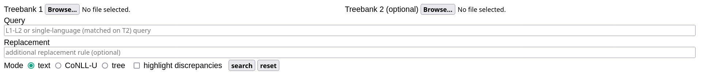
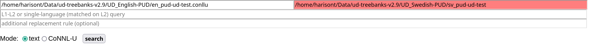
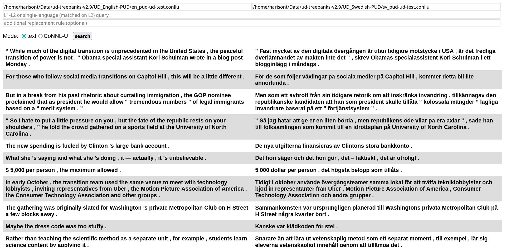
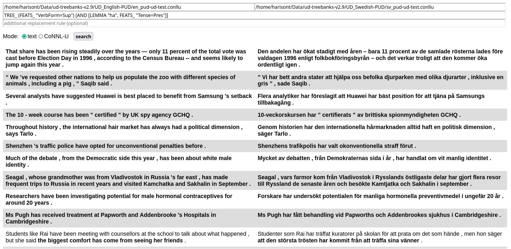
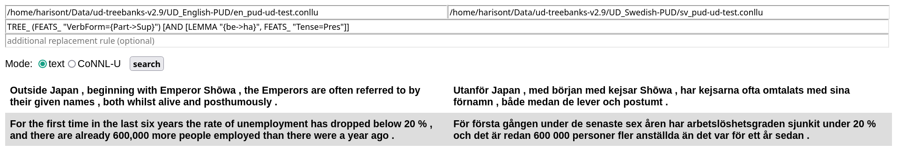
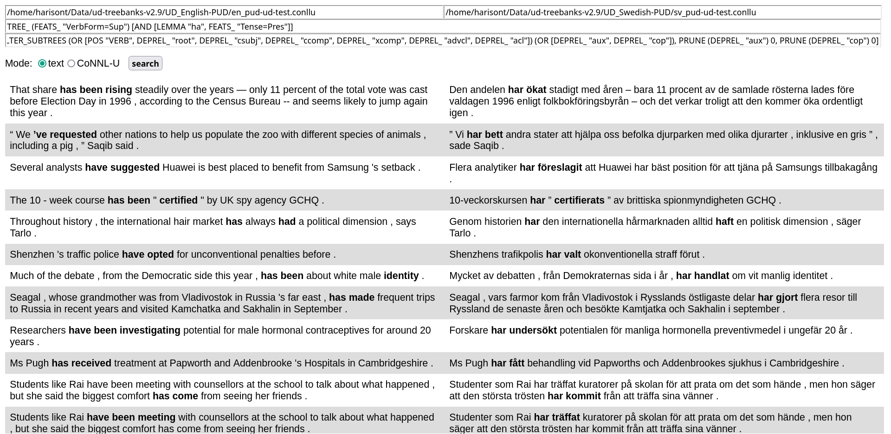
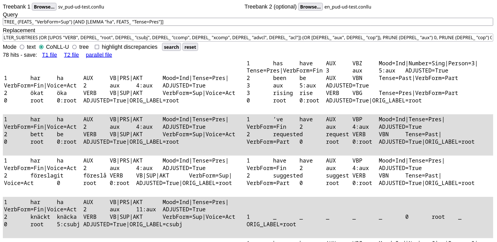
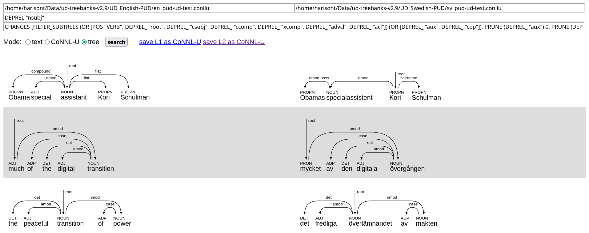
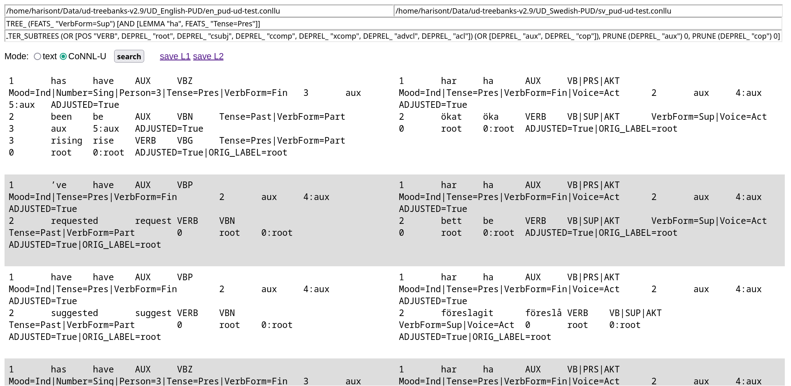

# STUnD
A prototype GUI Search Tool for (bilingual) parallel Universal Dependencies treebanks that runs in your browser.

---

## Installing STUnD
1. download the binary:
   - [Linux and hopefully MacOS](https://github.com/harisont/STUnD/releases/download/v0/stund-gui) (only tested on Manjaro)
   - [Windows](https://github.com/harisont/STUnD/releases/download/v0/stund-gui.exe) (only tested on Windows 10)
2. create a shortcut to start the GUI in one click:
   - on Linux, copy [the desktop file](stund.desktop) wherever you have your desktop files (`~/.local/share/applications/` maybe?)
   - on MacOS, I have no idea
   - on Windows, create a Desktop shortcut to [stund.ps1](stund.ps1), right click on it and make it executable on click by setting `Properties > Target` to `powershell.exe -ExecutionPolicy Bypass -File "WHATEVER-PATH-WAS-ALREADY-THERE"` (mind the quotes!)

As an alternative, you can also try...

## Compiling from source
By far the simplest way to compile STUnD is with [the Haskell Tool Stack](https://docs.haskellstack.org/en/stable/). If you do have Stack, running  

```
stack build
```

or

```
stack install
```

which also installs the executable, should be all that is needed enough. On Windows, however, you might encounter problems related to curl, STUnD's only external dependency. If that's the case, see [this](win.md).

Afterwards you can run STUnD using either `stack run` or run the installed executable directly.

### Run using Docker

If you want to use Docker containers, the simplest way is to use `docker compose`. To build and run the image you can simply type:

```
docker compose up stund-gui
```

This will take a while for the first time because the image has to be built. Afterwards, running the container can be started directly with the same command.

## Using STUnD

When you launch STUnD, a new tab will be opened in your browser.
You should see something like this:



### Specifying input files
The first two input fields are mandatory and used to specify the full paths (including the `.conllu` extension) of two __parallel__ [CoNNL-U](https://universaldependencies.org/format.html) files, for instance

```
~/Data/ud-treebanks-v2.9/UD_English-PUD/en_pud-ud-test.conllu
```

and

```
~/Data/ud-treebanks-v2.9/UD_Swedish-PUD/sv_pud-ud-test.conllu
```

If a path is invalid, for example because of a missing extension, the corresponding input field will turn red upon clicking the Search button:



If you only specify the input files, leaving the other fields blank, clicking search will display all sentences in the treebank:



### Running a query
Queries are specified in the third input field:



The example query in the picture is

```haskell
TREE_ (FEATS_ "VerbForm=Sup") [AND [LEMMA "ha", FEATS_ "Tense=Pres"]]
```

This is a _simple_ or _monolingual_ query, looking for present perfect constructions in the Swedish treebank (important note: __monolingual queries are always matched in the L2, i.e. right-hand-side treebank!__).
It reads as

> Look for (sub)trees (`TREE_`) where the root is a supinum (`(FEATS_ "VerbForm=Sup")`) and one of the direct dependents is the present perfect of the verb "ha" (`AND [LEMMA "ha", FEATS_ "Tense=Pres"]`).

Note that only the subtrees matching the query are now highlighted in bold (cf. last row).

With some knowledge of Swedish, this query can be rewritten more concisely as

```haskell
TREE_ (FEATS_ "VerbForm=Sup") [FORM "har"]
```

It is then very easy to modify the query for other structurally similar tenses:

- `TREE_ (FEATS_ "VerbForm=Sup") [FORM "hade"]` (pluperfect)
- `TREE_ (FEATS_ "VerbForm=Sup") [FORM "ha"]` (perfect infinitive)

Queries can also be _parallel_ or _bilingual_. For instance, we can use the following pattern to serach for sentences where a Swedish present perfect corresponds to a passive present tense in English:

```haskell
TREE_ (FEATS_ "VerbForm={Part->Sup}") [AND [LEMMA "{be->ha}", FEATS_ "Tense=Pres"]]
```

This produces the following results:



Note how the second hit here is a false positive, due to the fact that "are" in the clause "there are already..." is also a direct dependent of the main lexical verb "dropped".
This is unfortunate, but difficult to avoid given how conjuncts are treated in UD.

The basic query language ("UD patterns") is thoroughly described [here](https://github.com/GrammaticalFramework/gf-ud/blob/master/doc/patterns.md), while the extended version for parallel (bilingual) queries (`{X -> Y}` syntax) is documented [here](https://github.com/harisont/L2-UD#l1-l2-patterns).

### Adding a replacement rule
The last input field can be used to specify a _replacement rule_ to be applied identically to all matching subtrees in both languages.
This can help highlighting the relevant part of each query result.

Understanding replacement rules, which are described [alongside the basic query language](https://github.com/GrammaticalFramework/gf-ud/blob/master/doc/patterns.md), can be slightly more challenging, especially if for those not familiar with the UD standard. The plan is then to collect useful replacement rules down here.

As a first example,

```haskell
CHANGES [FILTER_SUBTREES (OR [POS "VERB", DEPREL_ "root", DEPREL_ "csubj", DEPREL_ "ccomp", DEPREL_ "xcomp", DEPREL_ "advcl", DEPREL_ "acl"]) (OR [DEPREL_ "aux", DEPREL_ "cop"]), PRUNE (DEPREL_ "aux") 0, PRUNE (DEPREL_ "cop") 0]
```

uses dependency relations to isolate verb constructions of max depth 2, thus producing, in conjunction with the first query, the following output:



### CoNNL-U mode
Switching to CoNNL-U mode allows to inspect the CoNNL-U (sub)trees __corresponding to bold text in the default text mode__:




### Tree mode (__experimental__)
In newer versions of STUnD (not yet released, but available upon compiling the `main` branch), switching to tree mode lets the user visualize the extracted subtrees:



### Saving the search results
After running a query, one or two links will appear next to the search button. These can be used to export the search results.

Text results can be saved as a single TSV file, that can be imported to any spreadsheet program.

In CoNNL-U and tree mode, the L1 and L2 can be saved as two separate CoNNL-U files. You will therefore see two links:



This results in a new parallel treebank that can, for instance, be used as input for more refined queries in StUnD, or simply imported into [a CoNNL-U viewer](https://universaldependencies.org/conllu_viewer.html) for further inspection.

Alternatively, selecting the entire page and copying the selection to a text file should also produce a valid CoNNL-U file[^1] where L1 and L2 trees are interleaved, as in:

```
1	has	have	AUX	VBZ	Mood=Ind|Number=Sing|Person=3|Tense=Pres|VerbForm=Fin	3	aux	5:aux	ADJUSTED=True
2	been	be	AUX	VBN	Tense=Past|VerbForm=Part	3	aux	5:aux	ADJUSTED=True
3	rising	rise	VERB	VBG	Tense=Pres|VerbForm=Part	0	root	0:root	ADJUSTED=True|ORIG_LABEL=root

1	har	ha	AUX	VB|PRS|AKT	Mood=Ind|Tense=Pres|VerbForm=Fin|Voice=Act	2	aux	4:aux	ADJUSTED=True
2	ökat	öka	VERB	VB|SUP|AKT	VerbForm=Sup|Voice=Act	0	root	0:root	ADJUSTED=True|ORIG_LABEL=root

1	’ve	have	AUX	VBP	Mood=Ind|Tense=Pres|VerbForm=Fin	2	aux	4:aux	ADJUSTED=True
2	requested	request	VERB	VBN	Tense=Past|VerbForm=Part	0	root	0:root	ADJUSTED=True|ORIG_LABEL=root

1	har	ha	AUX	VB|PRS|AKT	Mood=Ind|Tense=Pres|VerbForm=Fin|Voice=Act	2	aux	4:aux	ADJUSTED=True
2	bett	be	VERB	VB|SUP|AKT	VerbForm=Sup|Voice=Act	0	root	0:root	ADJUSTED=True|ORIG_LABEL=root

1	have	have	AUX	VBP	Mood=Ind|Tense=Pres|VerbForm=Fin	2	aux	4:aux	ADJUSTED=True
2	suggested	suggest	VERB	VBN	Tense=Past|VerbForm=Part	0	root	0:root	ADJUSTED=True|ORIG_LABEL=root

1	har	ha	AUX	VB|PRS|AKT	Mood=Ind|Tense=Pres|VerbForm=Fin|Voice=Act	2	aux	4:aux	ADJUSTED=True
2	föreslagit	föreslå	VERB	VB|SUP|AKT	VerbForm=Sup|Voice=Act	0	root	0:root	ADJUSTED=True|ORIG_LABEL=root

...
```

In both text and CoNNL-U mode, the correct file extension (`.tsv` or `.conllu`) is to be added manually upon choosing the file name.

## What's happening under the hood?
STUnD is basically a GUI for [L2-UD  `match`](https://github.com/harisont/L2-UD#querying-parallel-l1-l2-treebanks), which allows running parallel queries on UD treebanks by combining [UD-based subtree alignment](https://github.com/harisont/concept-alignment) with [UD tree pattern matching](https://github.com/GrammaticalFramework/gf-ud/blob/master/doc/patterns.md).

While L2-UD (where "L2" stands for "second language") was originally developed for comparing learner texts and corrections, the current STUnD prototype uses a slightly modified, "bilingual" or "2L" version of L2-UD, optimized for comparisons between different languages. In the future, it will be possible for the user to choose what version to use, meaning that the tool will be usable on both types of treebanks.

The GUI is currently implemented [threepenny-gui](https://hackage.haskell.org/package/threepenny-gui), but planned to evolve in a proper web application.

## Citing
If you use this tool, you are welcome to cite

```
@inproceedings{masciolini2024stund,
  title={{STUnD}: ett S{\"o}kverktyg f{\"o}r Tv{\aa}spr{\aa}kiga Universal Dependencies-tr{\"a}dbanker},
  author={Masciolini, Arianna and T{\'o}th, M{\'a}rton A},
  booktitle={Huminfra Conference},
  pages={95--109},
  year={2024}
}
```

[^1]: technical note: this works because all extracted subtrees are adjusted so that they have a root node and valid (sequential) IDs.   
