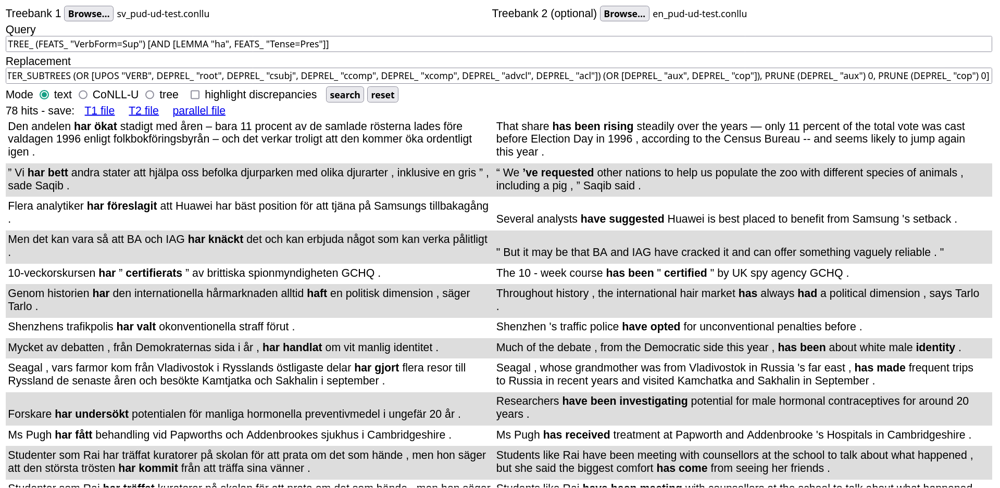

# STUnD

A Search Tool for (parallel) Universal Dependencies treebanks that runs in your browser.




- [live demo](https://demo.spraakbanken.gu.se/stund)
- [tutorial](tutorial.md)
- [installation](installation.md)

While STUnD can also be used on single dependency treebanks, its most unique feature is that it allows running parallel queries on sentence-aligned UD treebanks by combining [UD-based subtree alignment](https://github.com/harisont/concept-alignment) with [UD tree pattern matching](https://github.com/harisont/deptreehs/blob/main/pattern_matching_and_replacement.md).

STUnD is a Haskell+JavaScript web application built by Herbert Lange and Arianna Masciolini based on an initial prototype by Arianna Masciolini. 

## Citing
If you use this tool in your research, you are welcome to cite

```
@inproceedings{masciolini2024stund,
  title={{STUnD}: ett S{\"o}kverktyg f{\"o}r Tv{\aa}spr{\aa}kiga Universal Dependencies-tr{\"a}dbanker},
  author={Masciolini, Arianna and T{\'o}th, M{\'a}rton A},
  booktitle={Huminfra Conference},
  pages={95--109},
  year={2024}
}
```

A more extensive and up-to-date publication in English is currently in preparation.