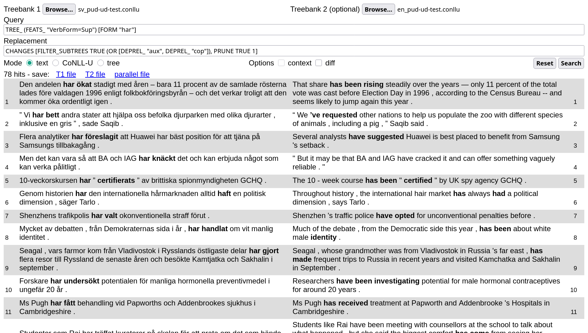

A Search Tool for (parallel) Universal Dependencies treebanks that runs [in your browser](https://demo.spraakbanken.gu.se/stund).

While STUnD can also be used on single dependency treebanks, its most unique feature is that it allows running parallel queries on sentence-aligned UD treebanks by combining [UD-based subtree alignment](https://github.com/harisont/concept-alignment) with [UD tree pattern matching](https://github.com/harisont/deptreehs/blob/main/pattern_matching_and_replacement.md).

## Learn more
- [live demo](https://demo.spraakbanken.gu.se/stund)
- [docs]([tutorial.md](https://harisont.github.io/STUnD/))

## Citing
STUnD is a Haskell+JavaScript web application built by Herbert Lange and Arianna Masciolini based on an initial prototype by Arianna Masciolini. 

If you use this tool in your research, you are welcome to cite

> [Arianna Masciolini and Márton A Tóth. _STUnD: ett Sökverktyg för Tvåspråkiga Universal Dependencies-trädbanker._ In Proceedings of the Huminfra Conference, pages 95–109, Gothenburg, Sweden, 2024](https://doi.org/10.3384/ecp205013) ([bibtex](docs/stund.bib)).

A more extensive and up-to-date publication in English is currently in preparation.