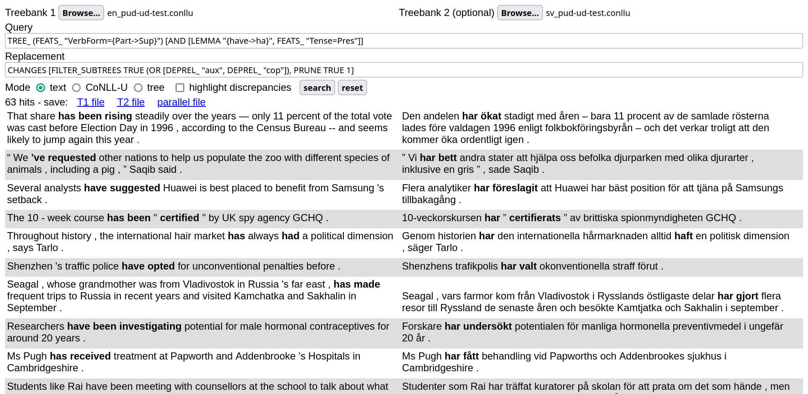

A Search Tool for (parallel) Universal Dependencies treebanks that runs [in your browser](https://demo.spraakbanken.gu.se/stund).

- [live demo](https://demo.spraakbanken.gu.se/stund)
- [tutorial](tutorial.md)
- [installation](installation.md)
- [source code](https://github.com/harisont/STUnD)

While STUnD can also be used on single dependency treebanks, its most unique feature is that it allows running parallel queries on sentence-aligned UD treebanks by combining [UD-based subtree alignment](https://github.com/harisont/concept-alignment) with [UD tree pattern matching](https://github.com/harisont/deptreehs/blob/main/pattern_matching_and_replacement.md).

STUnD is a Haskell+JavaScript web application built by Herbert Lange and Arianna Masciolini based on an initial prototype by Arianna Masciolini. 

## Citing
If you use this tool in your research, you are welcome to cite the following chapter:

> [Arianna Masciolini, Herbert Lange and Márton András Tóth. Exploring parallel corpora with STUnD: A Search Tool for Universal Dependencies. In Huminfra handbook: Empowering digital and experimental humanities, 2025](https://dspace.ut.ee/items/e71f6f63-a93b-4dae-909e-f3fa2083ef2c) [[bibtex]](https://raw.githubusercontent.com/harisont/harisont.github.io/main/assets/bibtex/hh_stund.bib)

If you want, you can also refer to a shorter, earlier publication in Swedish:

> [Arianna Masciolini and Márton A Tóth. _STUnD: ett Sökverktyg för Tvåspråkiga Universal Dependencies-trädbanker._ In Proceedings of the Huminfra Conference, Gothenburg, Sweden, 2024](https://doi.org/10.3384/ecp205013) [[bibtex](docs/stund.bib)].