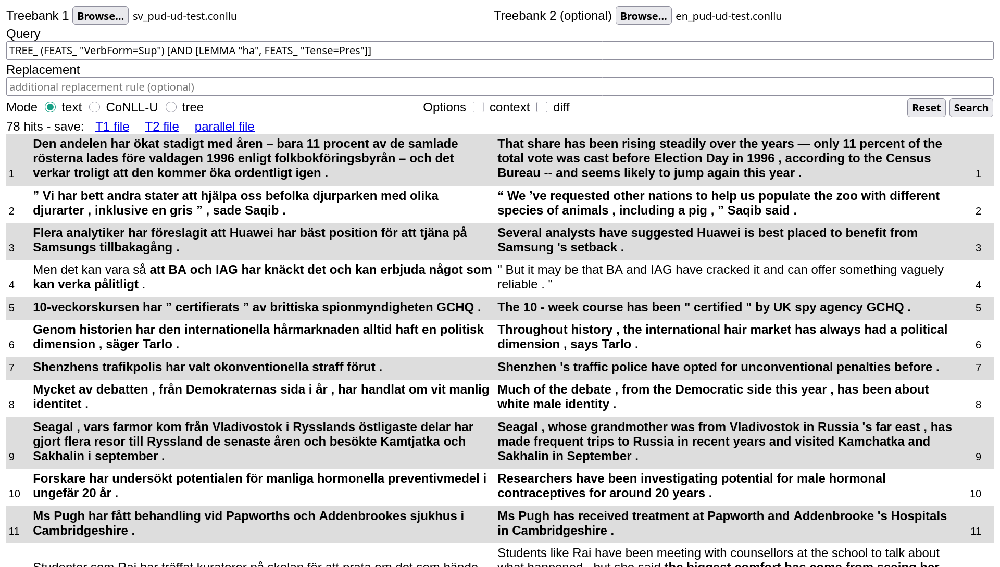

# Getting started with STUnD

## Specifying input files


The "Browse..." buttons are used to specify one or two (parallel) input files, which have to be in strict [CoNNL-U format](https://universaldependencies.org/format.html). 

If you only specify the input file(s), leaving the other fields blank, clicking "search" will run a default query that returns the full treebank:


## Running a query
Queries are specified in first text input field:



(note that double clicking on it will show the query history).

### Monolingual queries
The example query in the picture is

```haskell
TREE_ (FEATS_ "VerbForm=Sup") [AND [LEMMA "ha", FEATS_ "Tense=Pres"]]
```

This is a _simple_ or _monolingual_ query, looking for present perfect constructions in the Swedish treebank.
It reads as

> Look for (sub)trees (`TREE_`) where the root is a supinum (`(FEATS_ "VerbForm=Sup")`) and one of its direct dependents is the present of the verb "ha" (`AND [LEMMA "ha", FEATS_ "Tense=Pres"]`).

Now only the subtrees matching the query (often full trees in this case) are highlighted in bold (cf. last row). 

With some knowledge of Swedish, this particular query can be rewritten more concisely as

```haskell
TREE_ (FEATS_ "VerbForm=Sup") [FORM "har"]
```

It is then very easy to modify the query for other structurally similar tenses:

- `TREE_ (FEATS_ "VerbForm=Sup") [FORM "hade"]` (pluperfect)
- `TREE_ (FEATS_ "VerbForm=Sup") [FORM "ha"]` (perfect infinitive)

Compared to the original "present perfect" query, these make it easier to see how queries work: first, the program tries to align the two treebanks to identify semantically equivalent subtrees; then the query is run on the left (Swedish) treebank and matching subtrees are returned alongside their English counterpart.
For this reason, it can find correspondences such as "att ha sagt"-"as saying" (row 4), even though the English construction is not at all similar to the Swedish one. 
Unlike query matching, the alignment step is not guaranteed to find all correspondences: in the picture below, you can see that sometimes a match is found in the Swedish treebank but nothing is highlighted in the corresponding English sentence (this is the case, for instance, in the last few rows). Some other times, a correspondence is found but is incorrect. 


Of course, monolingual queries can also be run on single treebanks:


### Parallel queries
Queries can also be _parallel_ or _bilingual_. For instance, we can use the following pattern to serach for sentences where a Swedish present perfect corresponds to a passive present tense in English:

```haskell
TREE_ (FEATS_ "VerbForm={Sup->Part}") [AND [LEMMA "{ha->be}", FEATS_ "Tense=Pres"]]
```

This produces the following results:


Note that the second hit here is a false positive, due to the fact that "are" in the clause "there are already..." is also a direct dependent of the main lexical verb "dropped".
This is unfortunate, but difficult to avoid given how conjuncts are treated in UD.

The basic query language ("UD patterns") is described [here](https://github.com/harisont/deptreehs/blob/main/pattern_matching_and_replacement.md), while the extended version for parallel (bilingual) queries (`{X -> Y}` syntax) is documented [here](https://github.com/harisont/L2-UD#l1-l2-patterns).

## Adding a replacement rule
The last input field can be used to specify a _replacement rule_ to be applied to all matching subtrees in both languages.
This can help highlighting the relevant parts of each query result and manipulate them.

Understanding replacement rules, which are described [alongside the basic query language](https://github.com/harisont/deptreehs/blob/main/pattern_matching_and_replacement.md), can be slightly more challenging.

As a first example,

```haskell
PRUNE (UPOS "VERB") 0
```

decreases the depth of trees rooted in a verb to 0, eliminating all dependents:


The more complex pattern

```haskell
CHANGES [FILTER_SUBTREES TRUE (OR [DEPREL_ "aux", DEPREL_ "cop"]), PRUNE TRUE 1]
```

uses dependency labels to isolate verb constructions of maximum depth 1, thus producing, in conjunction with the first query, the following output:


## CoNNL-U and tree mode
So far, we have seen how to use STUnD in plain text mode.
Switching to CoNNL-U mode allows inspecting the CoNNL-U (sub)trees __corresponding to bold text in the default text mode__:


Tree mode renders them as SVG trees:


## Saving the search results
Query results can be saved as plain text/TSV, CoNNL-U and HTML-embedded SVG trees. 
The output format depends on the mode (in the example below, for instance, results would be saved as graphical trees).


If two treebanks are being compared, results can be saved as two separate files, one per treebank, or as a single "parallel" file:

- in text mode, the T1 and T2 files are simple text (one sentence per line), while the parallel file is tab-separated. This makes it easy to import search results in any spreadsheet program
- in CoNNL-U mode, the output is always a new treebank, treebank that can, for instance, be used as input for more refined queries in StUnD, or simply imported into [a CoNNL-U viewer](https://universaldependencies.org/conllu_viewer.html) for further inspection.[^1] In the parallel file, sentences from the two input treebanks are alternated
- similarly, parallel files in tree mode consist in alternating T1-T2 trees

## Other use cases
So far, we have shown how to use STUnD on multilingual treebanks. 
Many of the tool's functionalities, however, are also relevant in other scenarios, such as comparing learner sentences with corrections:


In the image above, you can see STUnD in action on the [VALICO treebank of L2 Italian](https://github.com/UniversalDependencies/UD_Italian-Valico), looking for feminine nouns incorrectly inflected as masculine.

By checking "highlight discrepancies", in addition, the tool will highlight all sentence pairs matching the query that present any difference:


In the case of a learner corpus, "discrepant" means "erroneous", but highlighting discrepancies can also be useful in other settings, such as when comparing different analyses of the same text to resolve disagreement in a linguistic annotation project.
This functionality is, however, still very rudimentary. 
In the future, the plan is to refine it to only highlight sentences where the discrepancy occurs in the subtree matching the query.

[^1]: technical note: this works because all extracted subtrees are adjusted so that they have a root node and valid (sequential) IDs.   
