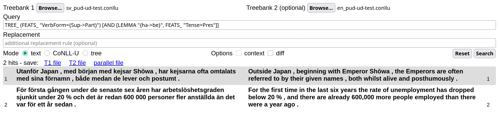
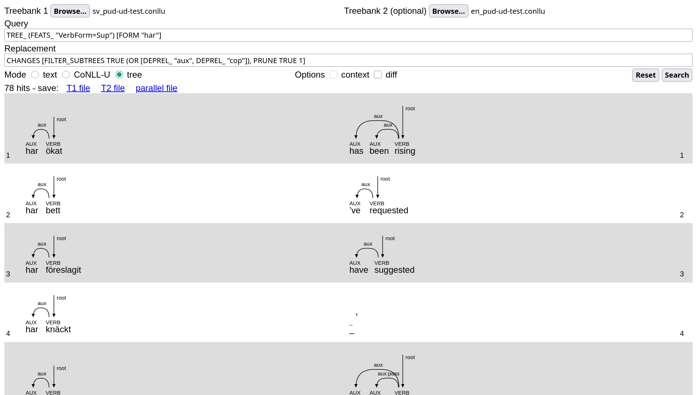

# Getting started with STUnD

## Specifying the input files


The "Browse..." buttons are used to specify one or two (parallel) input files, which have to be in either __strict [CoNNL-U format](https://universaldependencies.org/format.html)__ or __"horizontal" plain text__ (one sentence per line). 

Plain text files are parsed with the [UDPipe 2 API](https://lindat.mff.cuni.cz/services/udpipe/api-reference.php), using the default model for the language they are written in.
The language can be made explicit as a two-letter code followed by an underscore in the beginning of the name of the file (for example, an input file called `sv_rawtext.txt` would be assumed to be in Swedish). 
If this is not the case, the language is automatically inferred.

If you only specify the input file(s), leaving the other fields blank, clicking "Search" will run a default query that retrieves all sentences in the treebank(s):


## Running a query
Queries are specified in the first text input field:


(note that double clicking on it will show the query history).

### Monolingual queries
The example query in the picture is

```haskell
TREE_ (FEATS_ "VerbForm=Sup") [AND [LEMMA "ha", FEATS_ "Tense=Pres"]]
```

This is a _simple_ or _monolingual_ query, looking for present perfect constructions in the Swedish treebank.
It reads as

> Look for (sub)trees (`TREE_`) where the root is a supinum (`(FEATS_ "VerbForm=Sup")`), one of whose direct dependents is the present of the verb "ha" (`AND [LEMMA "ha", FEATS_ "Tense=Pres"]`).

Now only the subtrees matching the query (often full trees in this case) are highlighted in bold (cf. last row). 

With some knowledge of Swedish, this particular query can be rewritten more concisely as

```haskell
TREE_ (FEATS_ "VerbForm=Sup") [FORM "har"]
```

It is then very easy to modify the query for other structurally similar tenses:

- `TREE_ (FEATS_ "VerbForm=Sup") [FORM "hade"]` (pluperfect)
- `TREE_ (FEATS_ "VerbForm=Sup") [FORM "ha"]` (perfect infinitive)

Compared to the original "present perfect" query, these make it easier to see how queries work: first, the program tries to align the two treebanks to identify semantically equivalent subtrees; then the query is run on the left (Swedish) treebank  (T1) and matching subtrees are returned alongside their English counterpart (T2).

__Unlike query matching, the alignment step is not guaranteed to find _all_ correspondences__: in the picture above, you can see that sometimes a match is found in the Swedish treebank but nothing is highlighted in the corresponding English sentence (cf. row 4). 
Some other times, a correspondence is found but is incorrect. 
These two outcomes can be caused both by annotation errors and limitations of the alignment algorithm, which relies on a set of syntax-based heuristics.

Of course, monolingual queries can also be run on single treebanks:


### Parallel queries
Queries can also be _parallel_ or _bilingual_. For instance, we can use the following pattern to search for sentences where a Swedish present perfect corresponds to a passive present tense in English:

```haskell
TREE_ (FEATS_ "VerbForm={Sup->Part}") [AND [LEMMA "{ha->be}", FEATS_ "Tense=Pres"]]
```

This produces the following results:



Note that the second hit here is a false positive, due to the fact that "are" in the clause "there are already..." is also a direct dependent of the main lexical verb "dropped".
This is unfortunate, but difficult to avoid given how conjuncts are treated in UD.

The basic query language ("UD patterns") is described [here](https://github.com/harisont/deptreehs/blob/main/docs/patterns.md), while its extended version for parallel (bilingual) queries (`{X -> Y}` syntax) is documented [here](https://github.com/harisont/L2-UD#l1-l2-patterns).

## Refining the search results
The second input field can be used to specify a _replacement rule_ to be applied to all matching subtrees in both languages.
This can help highlight and manipulate the relevant parts of each query result them.

Understanding replacement rules, which are described [alongside the basic query language](https://github.com/harisont/deptreehs/blob/main/docs/patterns.md), can be slightly more challenging.

As a first example,

```haskell
PRUNE (UPOS "VERB") 0
```

decreases the depth of trees rooted in a verb to 0, eliminating all dependents:


The more complex pattern

```haskell
CHANGES [FILTER_SUBTREES TRUE (OR [DEPREL_ "aux", DEPREL_ "cop"]), PRUNE TRUE 1]
```

uses dependency labels to isolate verb constructions of maximum depth 1, thus producing, in conjunction with the first query, the following output:


## CoNNL-U and tree mode
So far, we have discussed how to use STUnD in plain text mode.
Switching to CoNNL-U mode allows inspecting the CoNNL-U (sub)trees __corresponding to bold text in the default text mode__:


Tree mode renders them as SVG trees:



## Saving the search results
Query results can be saved as TSV, CoNNL-U and HTML-embedded SVG trees. 
The output format depends on the mode in which STUnD is used: in the example above, for instance, results would be saved in SVG.

Results obtained on parallel treebanks can be saved as two separate files, one per treebank, by clicking on "T1 file" and "T2 file" respectively, or as a single file by choosing "parallel file":

- in text mode, the T1 and T2 files are horizontal text files, while the parallel file is TSV. This makes it easy to import search results in any spreadsheet program
- in CoNNL-U mode, the output is always a new CoNLL-U treebank that can be used, for instance, as input for more refined queries in StUnD, or simply imported into [another CoNNL-U viewer](https://universaldependencies.org/conllu_viewer.html) for further inspection. In parallel files, sentences from the two input treebanks are interleaved
- similarly, parallel files in tree mode alternate T1 with T2 trees

## Other functionalities

### Validation
STUnD performs some basic (i.e. __less strict than the [official UD validator](github.com/UniversalDependencies/tools/blob/master/validate.py)__) validation of the input data, checking that all word lines contain 10 tab-separated fields, as well as that all token IDs, UPOS tags and DEPRELs are valid as per the [UD universal annotation guidelines](https://universaldependencies.org/guidelines.html).
If the treebank contains one or more format errors, these are listed in the user interface:


### Diff mode
Diff mode, activated by checking the "diff" box, helps users identify discrepancies between two similar treebanks. 
This feature can be useful when exploring parallel (error-correction) learner treebanks, as well as when comparing alternative analyses of the same text, as in the following example:


### Manual editing
On top of replacement patterns, which can be used to apply systematic changes to the input treebank(s), basic manual editing functionalities are available in CoNLL-U mode.